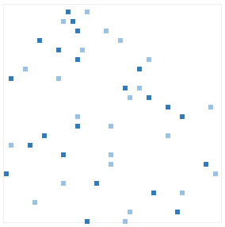

*Rx Training Games* provides a basic API for building games.

Squares of different colors are switched on and off in a graphical square grid :



The grid is first instantiated with the size of the activable squares : `api.initGrid(15);`

## Layers

Multiple layers with different colors can be added with `var layer = api.addLayer('#337ab7');`

A layer exposes the following methods :

 * `layer.fill({x: 42, y: 42});` : activate a square
 * `layer.clear({x: 42, y: 42});` : clear a square
 * `layer.getActiveSquares();` : retrieve a list of active squares
 
The layer is also implemented as an Observable Collection and provides two [Observables](http://reactivex.io/documentation/observable.html) :
 
```javascript
// square activations
layer.activations.subscribe(coord =>
    console.log(coord.x + ',' + coord.y + ' has been activated')
);

// square removals
layer.removals.subscribe(coord =>
    console.log(coord.x + ',' + coord.y + ' has been cleared')
);
```
 
## Keyboard events
 
Keyboard events are accessible using an Observable : 

```javascript
// keyboard events
api.keyboard.subscribe(keyCode =>
    console.log(keyCode)
);
```

## Directions

Most games have the concept of directions : Left, Up, Right and Down.

The API exposes these directions as well as convenient methods in `api.directions` object.

Both key codes and human readable names are available `console.log(_.keys(api.directions))` :

```javascript
["37", "38", "39", "40", "Left", "Up", "Right", "Down"]
```

These keys can be used to

*Filter keyboard events* :

```javascript
var directionKeys = api.keyboard.filter(keyCode =>
    keyCode in api.directions
);
```

*Update coordinates* :

```javascript
var newCoord = api.directions.Up({x: 42, y: 42});

var keyCode = '38';
var newCoord = api.directions[keyCode]({x: 42, y: 42});
```

## Miscellaneous methods

 * `api.gameSize()` : return the number of rows/columns
 * `api.setText('Score : 42')` : display text in the grid
 * `api.randomSquare()` : generate random valid xy coordinates (`{x: ?, y: ?}`) 
 * `api.randomCoord()` : generate a random valid coordinate (`{x: api.randomCoord(), y: 42}`)
 * `api.isOffLimits({x: 42, y: 42})` : return true if xy coordinates fall outside the grid
 * `api.isWithinLimits({x: 42, y: 42})` : return true xy coordinates fall inside the grid
 * `api.gameOver()` : end the game


## Contributing code samples

Do you think you can invent games with these simple elements? See [how to contribute](../../#how-to-contribute).